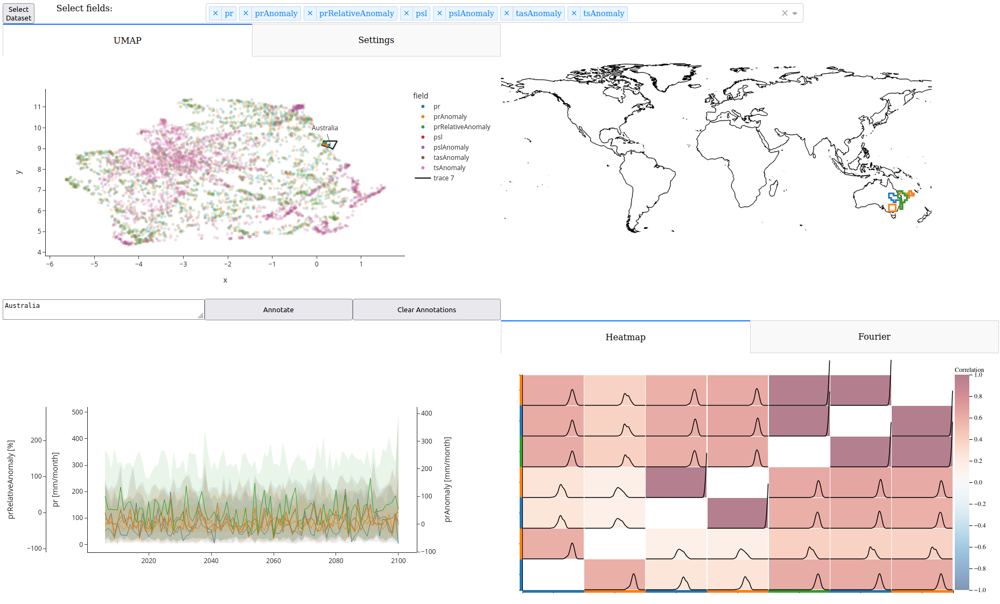

# Multifield Correlation Analysis for Spatio-Temporal Ensembles

This interactive visual analysis tool focuses on the analysis of correlations in spatio-temporal ensemble data. Our approach allows for finding correlations between spatial regions in different fields. Detection of clusters of strongly correlated spatial regions is supported by lower-dimensional embeddings. Then, groups can be selected and investigated in detail, e.g., to study the temporal evolution of the selected group, their Fourier spectra or the distribution of the correlations over the different ensemble members.

More information can be found in the paper *Interactive Visual Analysis of Regional Time Series Correlation in
Multi-field Climate Ensembles* by Marina Evers, Michael Böttinger and Lars Linsen.

If you use our approach, please cite our paper.
> (Citation added later)

```
Bibtex will be added later.
```



## Requirements

- Python < 3.11 (e.g. https://www.python.org/downloads/release/python-31010/)
- Node.js v16 (https://nodejs.org/en/blog/release/v16.19.1/)

The code was tested on Windows and Ubuntu.

# Installations
Before running our program, the visualizations need to be build and installed. Our program was tested on Windows and Linux.
Create a new virtual environment:
```
python -m venv venv
```
Activate the environment (Windows):
```
venv\Scripts\activate
```
Activate the environment (Linux):
```
source venv/bin/activate
```
Install the visualizations:
```
cd correlation_heatmap; pip install -r requirements.txt; npm install; npm run build; pip install .; cd ..
```
```
cd multi_field_map_view; pip install -r requirements.txt; npm install; npm run build; pip install .; cd ..
```
Install the other requirements for the tool:
```
cd Application; pip install -r requirements.txt; cd ..
```

## How to Run?
### Preprocessing
We included an artificial dataset such that the tool can be executed and tested directly after performing the preprocessing.
The ensemble data should be in a folder where each subfolder contains a single ensemble member's data. Inside each folder, there is a single .nc file containing the spatial time series information.
Switch to the 'Precomputations' folder and adapt the information in 'precomputations.py' to your data. Then run:
```
python precomputations.py
```

### Start the backend
```
cd Application; python app.py
```
When shown on the console, open http://127.0.0.1:8050

## How to Use?
### Load the data
After finishing the precomputations, all necesasry data is stored in the tmp_artificial folder (for the synthetic dataset). Here you also find a config.json file. Adapt this file when using own datasets.

To load the data into the application, choose "Select Dataset" and choose the config.json file.

### UMAP Embedding
For navigating in the visualization, the standard Plotly graph navigation tools can be used (see their documentation for further information, if necessary). When selecting points either with the lasse selection or the box selection, the corresponding segments are shown in the map view and will be used for the other visualizations as well.

TODO Annotationsy

### Map view
To select spatial regions for a correlation analysis, draw a lasso selection on the map. The corresponding segments will be selected automatically.

### Time Series View
As a default, the time series view is disabled as plotting many segments can take a long time. To enable it, go to the Settings tab. Also in this visualization, standard Plotly navigation is available

### Heatmap
The heatmap can be enabled in the settings tab. Here, it is also possible to toggle the visualization of the correlation distribution. When hovering over the heatmap, the corresponding segment is highlighted in the map view.

### Fourier
To show the Fourier transform of a selected time interval, the corresponding time interval needs to be selected in the time series view by brushing. Note, that only the time interval of the selection is considered, while the y-component is ignored. If a Fourier transform of the whole time span should be computed, the full time interval needs to be selected.

If you have further questions, please do not hesitate to contact us.

